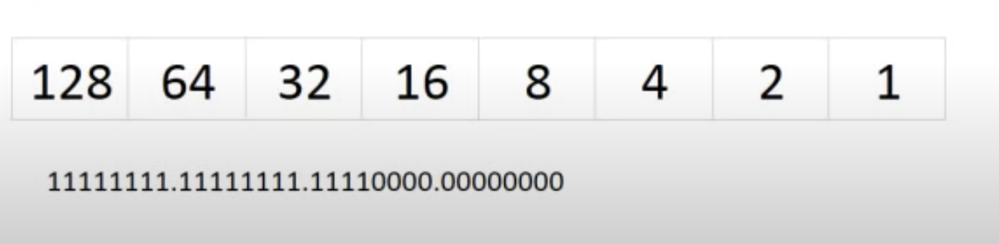
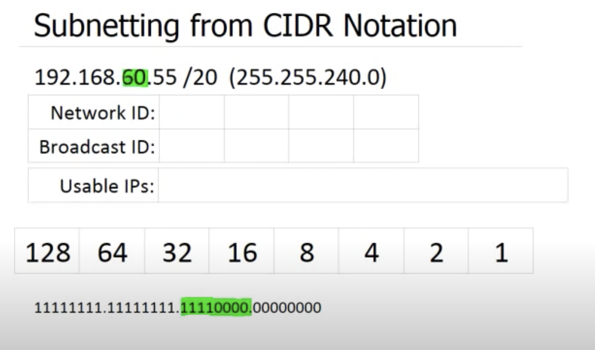
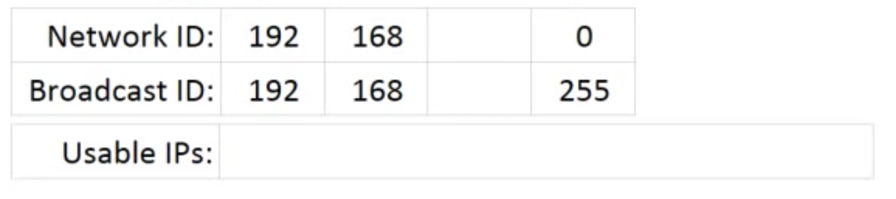
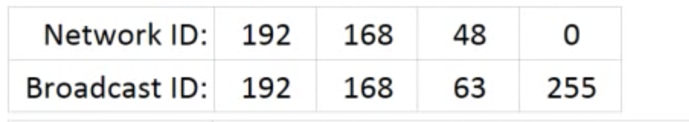
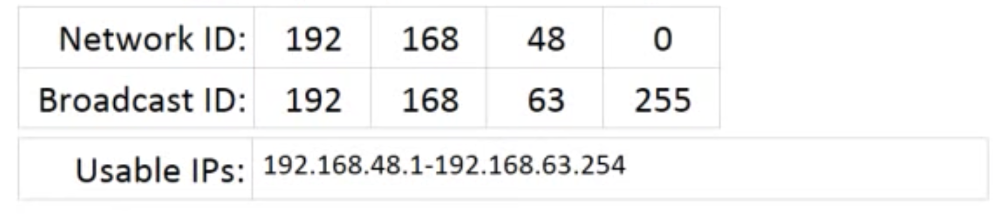

## Finding Given IP Address in Subnetwork

### Subnetting In CIDR Notation

Say we have a given IP address of 192.168.60.55 /20

We need to find both the Network and Broadcast IDs in order to find the range of usable IPs.
The usable IPs is a range of IP addresses with a low and high end. 
* The low end being Network ID plus 1
* The high end being Broadcast ID minus 1

#### CIDR Notation
* Stands for Classless Inter-Domain Routing, and is a compact representation of an IP address and its associated routing prefix and a method for allocating IP addresses and for IP routing.
* It is the "/" at the end of an IP address, like the "/20" in the example above.

To visualize what is going on, we can look at a Powers of Two table, and begin with the **Subnet Mask**, which is a [bitmask](https://en.wikipedia.org/wiki/Mask_(computing)) that encodes the prefix length associated with an IPv4 address or network in quad-dotted notation: 32 bits, starting with a number of 1 bits equal to the prefix length, ending with 0 bits, and encoded in four-part dotted-decimal format: ***255.255.255.0***.
* The CIDR notation is in simple terms, the number of bits turned on. (Represented by 1).



* Using our example above of a CIDR notation of /20, moving through the octets, this table shows we have 20 bits turned on. 8 for the first 2, and 4 for the third.
* Important to note, each position in the octet corresponds with a position in the Powers of Two table.
* Using this, it is simple to calculate the subnet mask.
  * The first two octets have all the bits turned on, so we know those will be *255*.
  * The third octet has 4 turned on, and this will correspond with the addition of their matching places in the table.
    * So, that would be *128 + 64 + 32 + 16*.
    * This equals *240*, and that is our third octet number.
    * Now we have our subnet: ***255.255.240.0***.


From here, we could translate each octet into binary, but in this example, that would be unnecessary. Since the first two are all on, and the last is all off, we can simply look at the third octet.



#### Converting to Binary

Since the first two octets are all turned on, we know they will be *192.168*, as well as the last octet being all zeros, that will be 0 for Network IP, and 255 for Broadcast ID.



Now to calculate, and since we already know the first two and last octets, those are represented in x's.
* The middle row is our subnet mask number we calculated earlier.
* The top number is the subnet mask converted to binary.
* The bottom number is the final number we get by applying what is called a logic table to determine what the IP address would be for that particular number.
* This works by taking both values, and if they both equal true, then it'll make it true. Almost like multiplication. The bottom number times the top.
```sh
xxxxxxxx.xxxxxxxx.00111100.xxxxxxxx
11111111.11111111.11110000.00000000
-----------------------------------
                 .00110000.
```
#### Binary
(*Top row in picture above*.) Use the Powers of Two table to determine. Starting with our IP number of 60, and moving through the table:
1. Can I take 128 out of 60? No.
2. Can I take 64 out of 60? No.
3. Can I take 32 out of 60? Yes. With 28 left over.
4. Can I take 16 out of 28? Yes. With 12 left over.
5. Can I take 8 out of 12? Yes. 4 left over.
6. Can I take 4 out of 4? Yes. Zero left over
7. Last two places are zero as we have used up all our bits.

#### Final Number - IP Address
* To get final number for our IP address, all we do is use the logic table to determine the values.
* So, just using the octet we have been looking at, we take the value of the subnet mask and 'multiply' it by the binary we just calculated.
* This results in an octet that represents the IP address.
```sh
.00111100.
.11110000.
----------
.00110000.
```
* The result is 48 because we have ones in the 32 and 16 positions in the Powers of Two tables. So 32 + 16 = 48.

#### Broadcast ID
To figure this number out, we need to find whatever number would be the next possible Network ID in the list, and the number right before it would be the Broadcast ID.
* This is determined by looking at something called the ***magic number***.
* The magic number is the last bit that is turned on in the subnet mask (in our case it is the 4th from the left)
  * That number represents 16
  * We add that number to the IP we just found, then subract 1.
  * So, 48 + 16 = 64
  * And 64 - 1 = ***63***
  * 

#### Final Range
Now that we have both the Network and Broadcast IDs we can calculate an upper and lower IP range.


* ***192.168.48.1 - 192.168.63.254***
* The last octet is plus one for the lower, and minus 1 for the upper because we cant assign a computer a *.0* address, nor a *.255* address.
